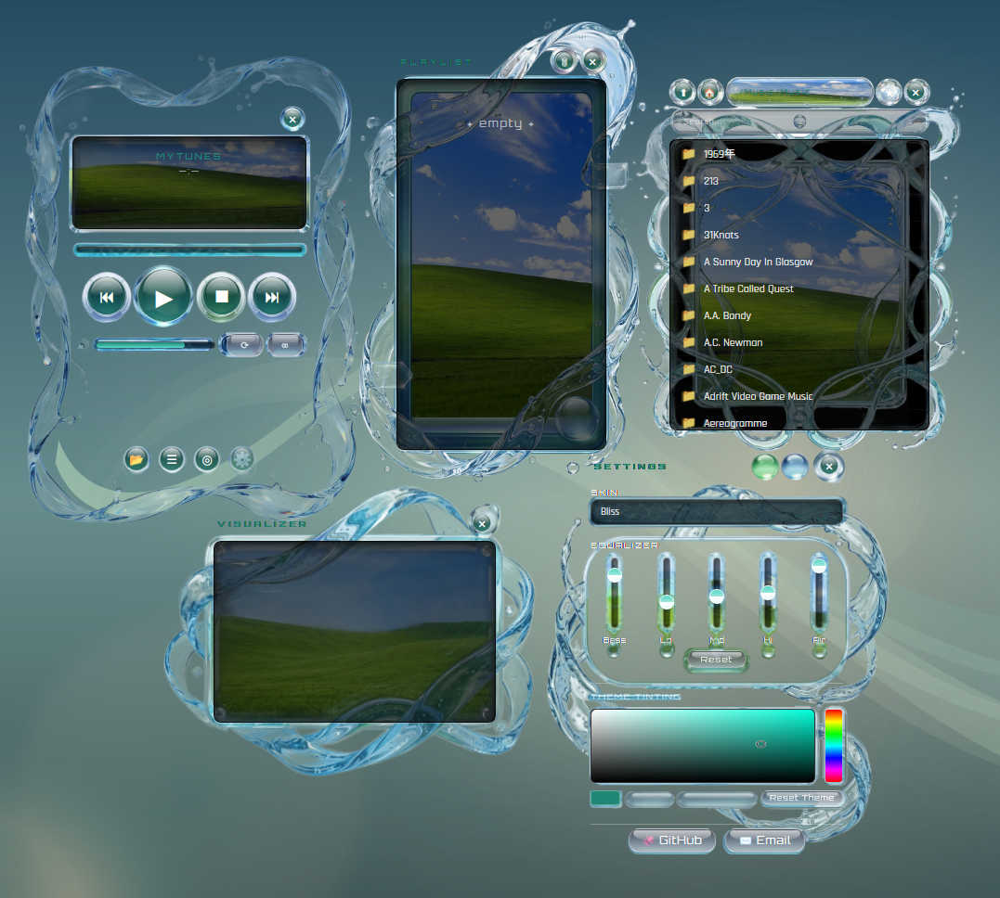
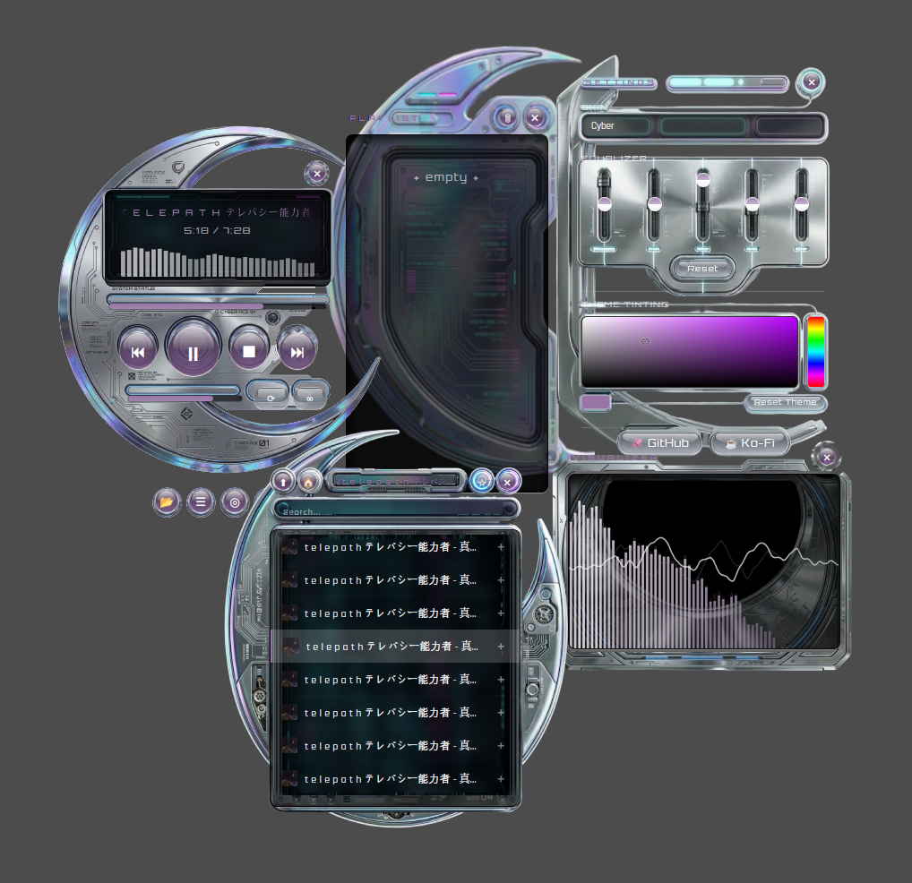
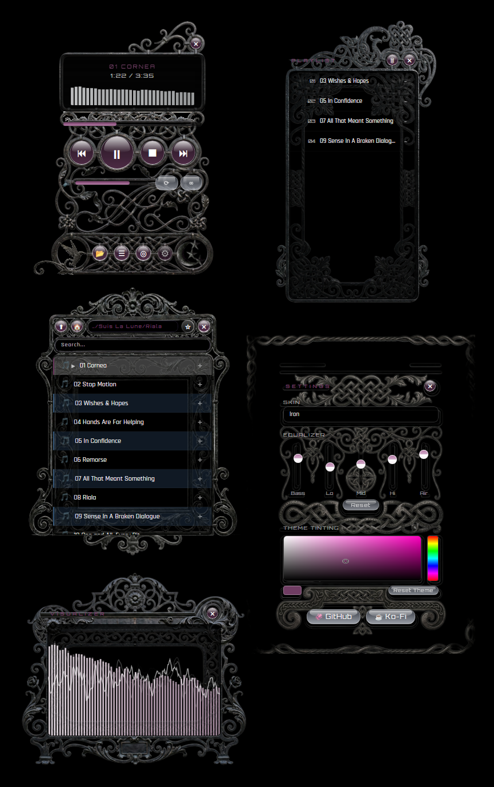
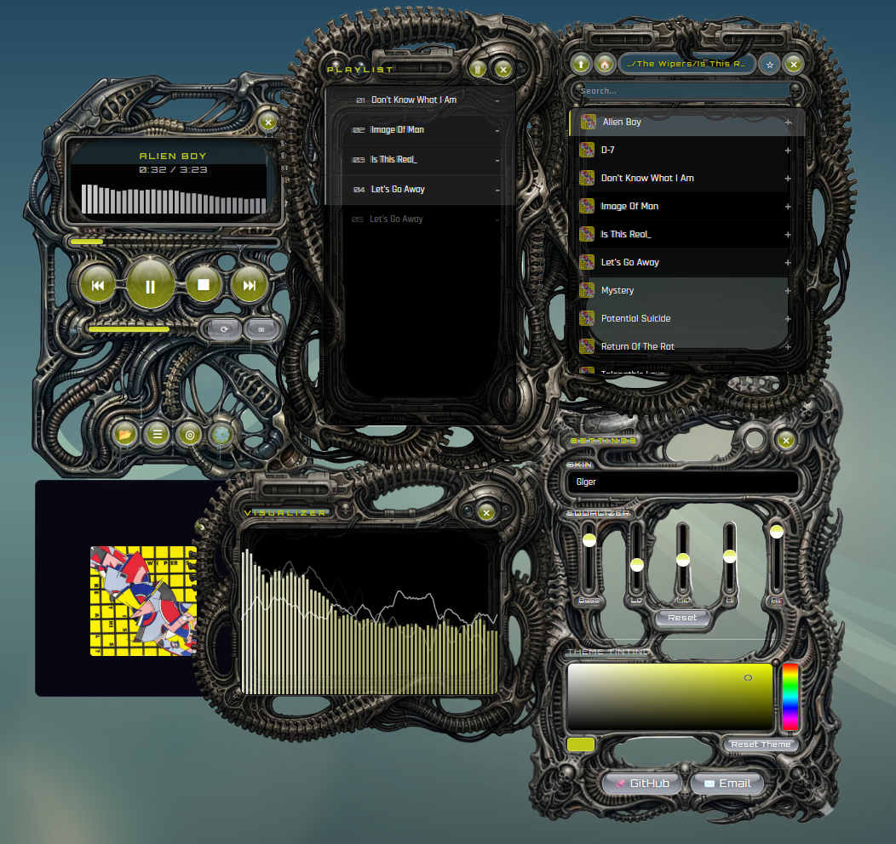

```
╔══════════════════════════════════════════════════════════════════╗
║                                                                  ║
║                        ─── myTunes ───                           ║
║                                                                  ║
║               customizable desktop music player                  ║
║                                                                  ║
╚══════════════════════════════════════════════════════════════════╝
```

> *Frameless. Transparent. Fully skinnable. Your desktop is the UI.*

---

## Screenshots

### Bliss


### Cyber


### Iron


### Giger


---

```
┌─────────────────────────────────────────────────────────────────┐
│                        F E A T U R E S                          │
└─────────────────────────────────────────────────────────────────┘
```

```
  ╭──────────────────────────────────────────────────────────╮
  │  ◈  Multi-window gel UI — player, browser, playlist,     │
  │     visualizer, and settings as independent windows      │
  │                                                          │
  │  ◈  4 unique skins — Bliss, Cyber, Iron, Giger, Metro    │
  │                                                          │
  │  ◈  Global theme color picker — tint everything at once  │
  │                                                          │
  │  ◈  5-band EQ — Bass, Lo, Mid, Hi, Air                   │
  │                                                          │
  │  ◈  Album cover viewer — embedded artwork display        │
  │                                                          │
  │  ◈  Real-time visualizer — waveform + frequency bars     │
  │                                                          │
  │  ◈  Pixel-perfect skinnability — swap skins with PNGs    │
  │                                                          │
  │  ◈  Skin templates included — create your own            │
  │                                                          │
  │  ◈  Transparent frameless windows — desktop-native       │
  │                                                          │
  │  ◈  Local playback — mp3, flac, wav, ogg, m4a, aac       │
  │                                                          │
  │  ◈  Cross-platform — macOS, Windows, Linux               │
  │                                                          │
  │  ◈  Rust + Tauri backend — lightweight and fast          │
  ╰──────────────────────────────────────────────────────────╯
```

---

```
┌─────────────────────────────────────────────────────────────────┐
│                      I N S T A L L                              │
└─────────────────────────────────────────────────────────────────┘
```

Pre-compiled installers for **macOS, Windows, and Linux** are coming soon.

Until then, build from source:

### Prerequisites

- Node.js
- Rust (`cargo`)
- OS-specific deps: C++ build tools (Windows), Xcode (macOS), WebKitGTK + libsoup (Linux)

### Run

```bash
git clone https://github.com/yourusername/myTunes.git
cd myTunes
npm install
npm run tauri dev
```

### Build

```bash
npm run tauri build
```

Output: `src-tauri/target/release/bundle/`

---

```
┌─────────────────────────────────────────────────────────────────┐
│                   C U S T O M   S K I N S                       │
└─────────────────────────────────────────────────────────────────┘
```

Skin templates are included in `skins/Template/`. Create a folder in `skins/` and drop in your PNGs:

```
skins/YourSkin/
  ├── player.png
  ├── browser.png
  ├── playlist.png
  ├── visualizer.png
  └── settings.png
```

The app mathematically conforms to the transparent edges of your artwork. Go wild.

---

```
┌─────────────────────────────────────────────────────────────────┐
│                       L I C E N S E                             │
└─────────────────────────────────────────────────────────────────┘
```

MIT License — see [LICENSE](LICENSE)

---

*Made with Claude Opus 4.6 and Gemini Nano Banana — March 2026*
